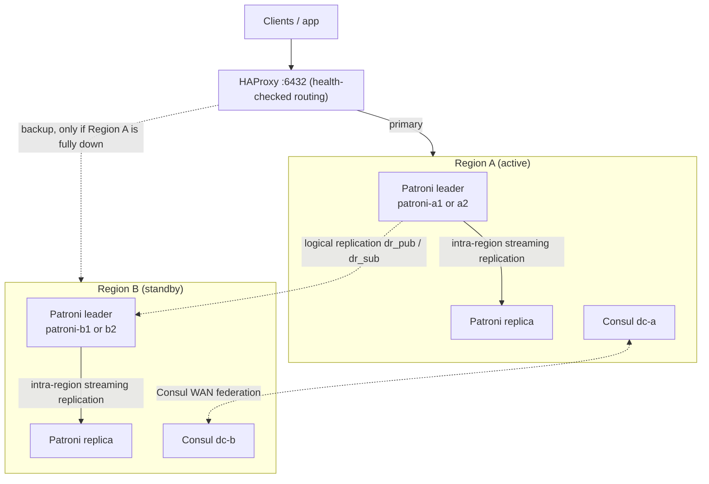

# Multi-Region Disaster Recovery — PostgreSQL / Patroni / Consul / HAProxy

Active-Passive multi-region PostgreSQL setup with Patroni-managed intra-region HA,
cross-region logical replication, Consul WAN federation, HAProxy health-checked
routing, and automated failover — with measured RTO/RPO numbers.

Two regions are simulated as two sets of Docker containers on a single host,
sharing one Docker bridge network (`dr-net`) and isolated logically by
container naming, Consul datacenter, and Postgres/Patroni ports.

---

## Architecture



**Components per region:** 2x Patroni-managed PostgreSQL nodes (1 leader + 1
intra-region replica), 1x Consul agent (leader election + WAN federation),
sharing 1x HAProxy in front of both regions.

**Replication direction:** Region A's Patroni leader publishes (`dr_pub`);
Region B's Patroni leader subscribes (`dr_sub`). One-way, Active-Passive.

**Failover path:** `monitor-and-failover.sh` polls Region A's `/health` every
3s. After 3 consecutive failures (~9s), it disables Region B's subscription
(making it authoritative) while HAProxy's own health checks independently
detect Region A is down and route traffic to Region B — no manual commands.

---

## Why Active-Passive (not Active-Active)

Active-Active needs conflict resolution (last-write-wins or write
partitioning) for concurrent writes to the same rows from both regions —
real complexity and a real risk of silent data loss. For a single logical
database with no natural write-partitioning, that complexity isn't worth it.
Active-Passive's cost is Region B mostly idling until failover; in exchange
you get one source of truth for writes at any time and RTO/RPO numbers that
are simple to reason about and prove. See `docs/dr-strategy.md` for the full
writeup.

---

## Prerequisites

- Ubuntu (or similar Linux) with Docker Engine + Docker Compose v2 plugin
- `bc`, `curl`, `git` installed
- **Important:** if more than one custom Docker bridge network will be
  created, see [Troubleshooting: Issue 3](#issue-3-second-custom-bridge-network-is-unreachable)
  first — this project works around a real Docker Engine bug by putting
  both regions on a single shared bridge network.

---

## Step-by-step setup

### 1. Project skeleton

```bash
mkdir -p ~/multi-region-dr && cd ~/multi-region-dr
git init && git branch -M main
mkdir -p region-a region-b docker/patroni consul scripts docs tests/rto-rpo logs haproxy shared
```

### 2. Shared Docker network (works around the bridge-network bug — see Troubleshooting)

```bash
docker network create dr-net
```

### 3. Patroni + PostgreSQL base image

`docker/patroni/Dockerfile`:
```dockerfile
FROM postgres:16

RUN apt-get update && \
    apt-get install -y --no-install-recommends python3-pip python3-dev libpq-dev build-essential curl netcat-openbsd && \
    pip3 install --break-system-packages "patroni[consul]" psycopg2-binary && \
    apt-get clean && rm -rf /var/lib/apt/lists/*

RUN mkdir -p /data/patroni && chown -R postgres:postgres /data/patroni
RUN echo "{}" > /patroni.yml && chown postgres:postgres /patroni.yml

COPY entrypoint.sh /entrypoint.sh
RUN chmod +x /entrypoint.sh

USER postgres
WORKDIR /home/postgres
EXPOSE 5432 8008
ENTRYPOINT ["/entrypoint.sh"]
```

`docker/patroni/entrypoint.sh` (self-heals a recurring permissions bug — see
Troubleshooting Issue 2):
```bash
#!/bin/bash
set -e
if [ -d /data/patroni ]; then
  chmod 0700 /data/patroni 2>/dev/null || true
fi
exec patroni /patroni.yml
```

### 4. Patroni config files (explicit YAML — env vars alone are not enough, see Issue 1)

`region-a/patroni-a1.yml` (repeat with adjusted `name`/`connect_address` for
`patroni-a2.yml`, `patroni-b1.yml`, `patroni-b2.yml`, using `scope:
region-a-cluster` / `region-b-cluster` and `consul.host: consul-a:8500` /
`consul-b:8500` accordingly):

```yaml
scope: region-a-cluster
namespace: /db/
name: patroni-a1

restapi:
  listen: 0.0.0.0:8008
  connect_address: patroni-a1:8008

consul:
  host: consul-a:8500

bootstrap:
  dcs:
    ttl: 30
    loop_wait: 10
    retry_timeout: 10
    maximum_lag_on_failover: 1048576
    postgresql:
      use_pg_rewind: true
      parameters:
        wal_level: logical
        max_replication_slots: 10
        max_wal_senders: 10
  initdb:
    - encoding: UTF8
    - data-checksums
  pg_hba:
    - host replication replicator 0.0.0.0/0 md5
    - host all all 0.0.0.0/0 md5
  users:
    admin:
      password: admin
      options: [createrole, createdb]

postgresql:
  listen: 0.0.0.0:5432
  connect_address: patroni-a1:5432
  data_dir: /data/patroni
  pgpass: /tmp/pgpass
  authentication:
    replication: {username: replicator, password: replpass}
    superuser: {username: postgres, password: postgres}
  parameters:
    unix_socket_directories: '/tmp'

tags:
  nofailover: false
  noloadbalance: false
  clonefrom: false
  nosync: false
```

### 5. Region A compose (`region-a/docker-compose.yml`)

```yaml
networks:
  dr-net:
    external: true

services:
  consul-a:
    image: hashicorp/consul:1.19
    container_name: consul-a
    hostname: consul-a
    entrypoint: ["sh", "-c"]
    command:
      - |
        MY_IP=$$(hostname -i)
        exec consul agent -dev \
          -client=0.0.0.0 -ui \
          -datacenter=dc-a -node=consul-a \
          -advertise-wan=$$MY_IP -serf-wan-bind=$$MY_IP \
          -retry-join-wan=consul-b
    networks: [dr-net]
    ports: ["8500:8500"]

  patroni-a1:
    build: {context: ../docker/patroni}
    container_name: patroni-a1
    hostname: patroni-a1
    networks: [dr-net]
    depends_on: [consul-a]
    volumes:
      - patroni_a1_data:/data/patroni
      - ./patroni-a1.yml:/patroni.yml:ro
    ports: ["5501:5432", "8008:8008"]

  patroni-a2:
    build: {context: ../docker/patroni}
    container_name: patroni-a2
    hostname: patroni-a2
    networks: [dr-net]
    depends_on: [consul-a]
    volumes:
      - patroni_a2_data:/data/patroni
      - ./patroni-a2.yml:/patroni.yml:ro
    ports: ["5502:5432", "8009:8008"]

volumes:
  patroni_a1_data:
  patroni_a2_data:
```

`region-b/docker-compose.yml` mirrors this with `consul-b` (`-datacenter=dc-b`,
`-retry-join-wan=consul-a`), `patroni-b1`/`patroni-b2`, and ports `8501`,
`5601/8018`, `5602/8019`.

### 6. Bring both regions up

```bash
cd ~/multi-region-dr/region-a && docker compose up -d --build
cd ~/multi-region-dr/region-b && docker compose up -d --build
sleep 20
docker exec patroni-a1 patronictl -c /patroni.yml list
docker exec patroni-b1 patronictl -c /patroni.yml list
```

Expect one Leader + one Replica (streaming, 0 lag) per region.

### 7. Verify Consul WAN federation

```bash
docker exec consul-a consul members -wan
# Both consul-a.dc-a and consul-b.dc-b should show "alive"
```

### 8. Cross-region logical replication

```bash
# On Region A's current leader (find with: patronictl list)
docker exec patroni-a1 psql -h 127.0.0.1 -U postgres -c \
  "CREATE TABLE IF NOT EXISTS dr_test (id SERIAL PRIMARY KEY, message TEXT, created_at TIMESTAMP DEFAULT now());"
docker exec patroni-a1 psql -h 127.0.0.1 -U postgres -c "CREATE PUBLICATION dr_pub FOR TABLE dr_test;"
docker exec patroni-a1 psql -h 127.0.0.1 -U postgres -c "ALTER USER replicator WITH SUPERUSER;"

# On Region B's current leader
docker exec patroni-b1 psql -h 127.0.0.1 -U postgres -c \
  "CREATE TABLE IF NOT EXISTS dr_test (id SERIAL PRIMARY KEY, message TEXT, created_at TIMESTAMP DEFAULT now());"
docker exec patroni-b1 psql -h 127.0.0.1 -U postgres -c "
CREATE SUBSCRIPTION dr_sub
CONNECTION 'host=patroni-a1 port=5432 dbname=postgres user=replicator password=replpass'
PUBLICATION dr_pub;"
```

Verify: insert on A, check it appears on B within a couple seconds.

**Important:** point the subscription's `host=` at whichever node is the
*current* Patroni leader — see [Issue 4](#issue-4-replication-breaks-after-intra-region-failover).
In production, point it at a stable VIP or HAProxy endpoint instead of a raw
container name.

### 9. HAProxy (`haproxy/haproxy.cfg`)

```cfg
global
    log stdout format raw local0
    maxconn 100

defaults
    log global
    mode tcp
    timeout connect 5s
    timeout client 30s
    timeout server 30s

listen postgres_write
    bind *:6432
    option httpchk GET /leader
    http-check expect status 200
    default-server inter 3s fall 2 rise 1 on-marked-down shutdown-sessions
    server patroni-a1 patroni-a1:5432 check port 8008
    server patroni-a2 patroni-a2:5432 check port 8008
    server patroni-b1 patroni-b1:5432 check port 8008 backup
    server patroni-b2 patroni-b2:5432 check port 8008 backup

listen stats
    bind *:7000
    mode http
    stats enable
    stats uri /
    stats refresh 5s
```

```bash
cd ~/multi-region-dr/haproxy && docker compose up -d
curl -s http://localhost:7000/\;csv | cut -d, -f1,2,18 | grep patroni
```

### 10. Start the automated failover monitor

```bash
~/multi-region-dr/scripts/monitor-and-failover.sh
```

Leave this running in its own terminal. It polls Region A every 3s and, after
3 consecutive failures, disables Region B's subscription and confirms
HAProxy has switched routing — fully automated, no manual promotion commands.

### 11. Run the full RTO/RPO test cycle

```bash
~/multi-region-dr/scripts/rpo-rto-full-cycle.sh
```

This single script: writes load to Region A, kills Region A, waits for
automated failover, measures RTO/RPO, brings Region A back, reverse-syncs it
from Region B (failback), and restores forward replication — ready to run
again. Run it 2-3 times to demonstrate consistency.

---

## Results (3 consecutive runs)

| Run | RTO (s) | RPO (rows lost) | Notes |
|-----|---------|------------------|-------|
| 1   | 10.24   | 0                | Clean run |
| 2   | 10.25   | 0                | Clean run |
| 3   | 10.41   | 0                | Failback subscription slow to catch up; script's automatic pg_dump/restore fallback completed the sync |

Replication lag under continuous load (100 rows / 30s): **0 bytes** measured
via `pg_replication_slots.confirmed_flush_lsn` vs `pg_current_wal_lsn()`.

Full breakdowns: `docs/replication-lag.md`, `docs/rto-rpo-results.md`.

---

## Failback procedure

Failback is a **deliberate, planned operation**, not automatic — an automatic
failback could re-promote a region whose root cause isn't actually fixed,
causing a second outage.

1. Confirm Region A's Patroni cluster is healthy (`patronictl list`).
2. Create a reverse publication on Region B (now authoritative) and a
   subscription on Region A, so A catches up on everything it missed.
3. Confirm `max(id)` matches exactly on both sides.
4. Either: (a) disable the reverse subscription, recreate the original
   forward publication/subscription, and switch HAProxy back to treating
   Region A as primary — or (b) simply keep Region B as the new permanent
   primary and treat Region A as the new standby going forward (avoids a
   second cutover risk window).

Full worked example with exact commands: `docs/dr-strategy.md`.

---

## Troubleshooting

### Issue 1: Patroni cluster stuck "uninitialized"

**Symptom:** Both nodes loop "waiting for leader to bootstrap" forever.
**Cause:** Config was env-vars-only (`PATRONI_*`) with an empty `/patroni.yml`
(`{}`). This Patroni/Postgres combination needs an explicit `bootstrap:`
section in the YAML — env vars alone don't trigger bootstrap.
**Fix:** Use full YAML config files (see Setup step 4), mounted read-only.

### Issue 2: Replica fails — "data directory has invalid permissions"

**Symptom:** `FATAL: data directory "/data/patroni" has invalid permissions`
after a basebackup.
**Cause:** Basebackup sometimes leaves permission bits that don't satisfy
Postgres's strict check (must be exactly 0700 or 0750).
**Immediate fix:**
```bash
docker exec -u root <container> chmod 0700 /data/patroni
docker exec -u root <container> chown -R postgres:postgres /data/patroni
docker restart <container>
```
**Permanent fix:** `entrypoint.sh` wrapper runs `chmod 0700` before every
Patroni start (see Setup step 3).

### Issue 3: Second custom bridge network is unreachable

**Symptom:** Containers on the *first* custom Docker bridge network
(`region-a-net`) could reach each other fine. Containers on the *second*
(`region-b-net`) could not — `curl`/`psql` between them always timed out,
despite correct DNS, correct ARP, TX packets leaving the container, veth
pairs `UP`/`forwarding`, correct `iptables` ACCEPT rules, and `br_netfilter`
loaded. Packet captures showed the SYN never reached the destination
container's veth and never hit the `FORWARD` chain — dropped purely at L2
bridging.

**What did NOT fix it:** recreating the network/containers, restarting the
Docker daemon (worked once transiently, failed again on rebuild), removing
libvirt, leaving Docker Swarm mode, manually adding `iptables -I
DOCKER-FORWARD -i <bridge> -j ACCEPT`, disabling NIC offload via `ethtool`,
rebooting the host, creating the networks in reverse order or with a delay.

**Pattern:** whichever bridge network was created **second** always failed —
true regardless of whether Region A or B was created first. Points to a
Docker Engine (v29.1.3 at time of testing) bug/race in iptables rule
generation for the *n*-th custom bridge network in a session.

**Working fix:** put both regions on **one** shared bridge network (`dr-net`,
created once, referenced as `external: true`). Since only one custom bridge
is ever created, the bug never triggers. Region isolation stays logical
(container names, Consul datacenter, ports) — representative of two regions
connected over a routed network in reality.

### Issue 4: Replication breaks after intra-region failover

**Symptom:** `CREATE SUBSCRIPTION` hangs for minutes with the backend stuck
in `wait_event=LibPQWalReceiverReceive`, or an existing subscription shows
`state=startup` indefinitely.
**Cause:** The subscription's `CONNECTION` string was hardcoded to a specific
node (e.g. `host=patroni-a1`). After repeated stop/start cycles, Patroni
performed an intra-region leader election and `patroni-a2` became the new
leader. A replica can't serve the publication anymore, so the WAL receiver
hangs waiting for data that will never come.
**Immediate fix:** `pg_terminate_backend()` the stuck PID on the publisher
(find it via `pg_stat_activity` + `wait_event=LibPQWalReceiverReceive`), then
`ALTER SUBSCRIPTION ... CONNECTION '...'` pointing at the current leader.
**Production-correct fix:** never hardcode a node hostname in the
subscription. Point it at a stable endpoint that always resolves to the
current leader — this project's HAProxy `:6432` listener is exactly that.

### General debugging tips learned this session

- `docker exec -it ... psql -h 127.0.0.1 ...` is required (not the default
  socket path) because Patroni config sets `unix_socket_directories: '/tmp'`.
- If a `psql`/`docker exec` command seems to hang, **wait at least 15-20
  seconds before Ctrl+C** — `CREATE SUBSCRIPTION` genuinely takes that long
  sometimes, and cancelling mid-operation can leave orphaned replication
  slots or stuck backends that then block the *next* attempt.
- Check `pg_stat_activity` (`wait_event`, `query_start`) before assuming a
  hang is a bug — it usually points straight at the cause.
- `pg_replication_slots.active=t` with no matching row in the subscriber's
  `pg_subscription` means an orphaned slot — `pg_terminate_backend()` its
  `active_pid`, which auto-drops it, then retry.

---

## Repository layout

```
multi-region-dr/
├── docker/patroni/          # Shared Patroni+Postgres image, entrypoint.sh
├── region-a/                # Region A compose + Patroni configs
├── region-b/                # Region B compose + Patroni configs
├── haproxy/                 # HAProxy config + compose
├── scripts/
│   ├── monitor-and-failover.sh      # Continuous health monitor + auto-promote
│   ├── measure-replication-lag.sh   # Load test + lag measurement
│   └── rpo-rto-full-cycle.sh        # Full kill -> failover -> failback cycle
├── docs/
│   ├── dr-strategy.md        # Active-Passive rationale + failback procedure
│   ├── replication-lag.md    # Lag measurement results
│   ├── rto-rpo-results.md    # 3-run RTO/RPO results
│   ├── troubleshooting.md    # Full issue write-ups
│   └── architecture-diagram.svg
└── logs/                    # Test run logs (timestamped)
```
